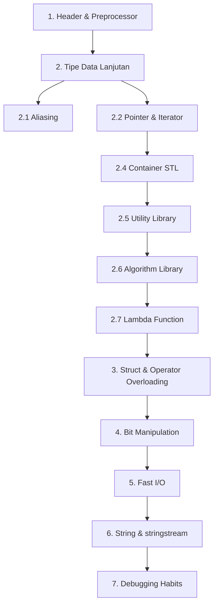
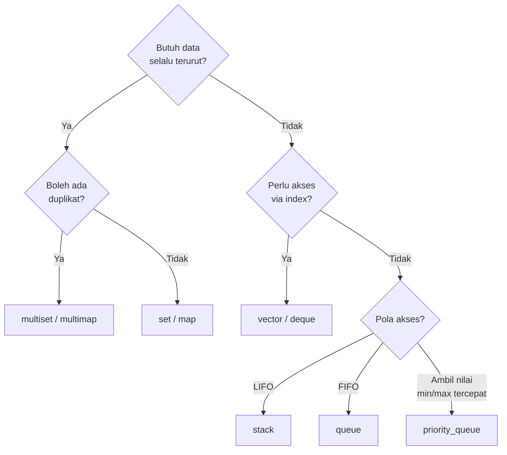

# C++ untuk Competitive Programming — Level Intermediate

> [!NOTE]
> Ini adalah materi lengkap yang ditulis berdasarkan outline di [`cpp-intermediate.md`](./cpp-intermediate.md). Urutan topik sama dengan outline (dari yang paling sering dipakai ke yang lebih jarang), sehingga kamu bisa membaca modul ini secara berurutan dari atas ke bawah.

> [!TIP]
> Target pembaca: sudah paham sintaks dasar C++ (variabel, tipe data primitif, if/else, loop, function) dan ingin naik level ke kebiasaan yang umum dipakai di competitive programming (CP).

## Daftar Isi

- [1. Header & Preprocessor](#1-header--preprocessor)
- [2. Tipe Data Lanjutan](#2-tipe-data-lanjutan)
  - [2.1 Aliasing](#21-aliasing)
  - [2.2 Pointer & Referensi](#22-pointer--referensi)
  - [2.3 Iterator](#23-iterator)
  - [2.4 Container (STL)](#24-container-stl)
  - [2.5 Utility Library](#25-utility-library)
  - [2.6 Algorithm Library](#26-algorithm-library)
  - [2.7 Lambda Function](#27-lambda-function)
- [3. Struct, Class, dan Operator Overloading](#3-struct-class-dan-operator-overloading)
- [4. Bit Manipulation](#4-bit-manipulation)
- [5. Fast I/O & Optimisasi](#5-fast-io--optimisasi)
- [6. String Manipulation & `stringstream`](#6-string-manipulation--stringstream)
- [7. Debugging & Testing Habits](#7-debugging--testing-habits)
- [Latihan Mandiri](#latihan-mandiri)
- [Referensi](#referensi)

## Roadmap



---

## 1. Header & Preprocessor

### 1.1 `<bits/stdc++.h>`

`<bits/stdc++.h>` adalah header "gado-gado" yang berisi hampir seluruh header standard library C++ sekaligus: `<vector>`, `<string>`, `<algorithm>`, `<map>`, `<set>`, `<queue>`, `<cmath>`, dan puluhan header lain. Header ini bukan bagian resmi dari standar C++, melainkan header internal implementasi GCC/libstdc++ yang "kebetulan" bisa diakses langsung.

```cpp
#include <bits/stdc++.h>
using namespace std;
```

**Kelebihan:**

- Praktis — tidak perlu mengingat dan menulis satu-satu header untuk `vector`, `map`, `algorithm`, dst.
- Mempercepat proses menulis solusi saat kontes, di mana waktu sangat berharga.

**Kekurangan:**

- Waktu kompilasi lebih lama karena compiler harus memproses ratusan header sekaligus, walau sebagian besar tidak dipakai.
- Tidak portable — hanya bekerja baik di GCC/MinGW. Compiler lain seperti MSVC atau Clang (tanpa konfigurasi khusus) tidak menyediakan header ini, sehingga kode tidak akan bisa dikompilasi.

> [!WARNING]
> Karena `<bits/stdc++.h>` bukan header standar resmi, jangan gunakan di proyek production atau kode yang harus portable ke banyak compiler. Gunakan hanya untuk kontes/latihan di mana lingkungan compiler sudah diketahui (biasanya GCC).

**Kapan dipakai:**

- ✅ Saat mengikuti kontes atau latihan soal (OSN, Codeforces, AtCoder, CSES) — judge biasanya memakai GCC.
- ❌ Saat menulis library atau aplikasi production yang harus portable dan dikompilasi cepat.

### 1.2 Macro dengan `#define`

`#define` adalah instruksi **preprocessor**: sebelum kompilasi sesungguhnya dimulai, preprocessor akan mencari semua pemakaian macro di kode lalu menggantinya secara **tekstual (text substitution)**, mirip fitur "find & replace".

Ada dua jenis macro:

**1. Macro konstanta** — menggantikan sebuah token dengan nilai tetap:

```cpp
#define MAXN 100005
#define MOD 1000000007
```

Setiap kemunculan `MAXN` di kode akan digantikan dengan `100005` sebelum kompilasi.

**2. Macro function-like** — menggantikan pemanggilan seperti fungsi dengan ekspresi template:

```cpp
#define SQ(x) ((x) * (x))
#define MAX2(a, b) ((a) > (b) ? (a) : (b))
```

Di CP, macro function-like sering dipakai untuk mempersingkat pola yang berulang-ulang. Beberapa contoh macro yang umum ditemukan di kode kontestan (sekadar daftar contoh, bukan anjuran untuk selalu dipakai):

| Macro         | Kepanjangan/maksud                                                               |
| ------------- | -------------------------------------------------------------------------------- |
| `ll`          | alias singkat untuk `long long`                                                  |
| `pb`          | singkatan `push_back`                                                            |
| `all(x)`      | menghasilkan `x.begin(), x.end()` untuk dipakai di `sort(all(v))`                |
| `endl` custom | kadang di-redefine agar selalu `'\n'` (lihat [Bagian 5](#5-fast-io--optimisasi)) |

> [!WARNING]
> **Risiko macro function-like:** karena sifatnya text substitution murni (tidak type-safe, tidak ada evaluasi urutan operand seperti fungsi biasa), macro bisa menimbulkan bug yang sulit dilacak lewat _side effect ganda_ pada argumen.
>
> Contoh kasus klasik:
>
> ```cpp
> #define SQ(x) x*x
>
> int a = 3, b = 4;
> int hasil = SQ(a + b); // programmer mengira hasil = (a+b)*(a+b) = 49
> ```
>
> Setelah text substitution, baris di atas menjadi `a + b*a + b`, bukan `(a+b)*(a+b)`. Hasilnya `3 + 4*3 + 4 = 19`, bukan `49`. Solusinya adalah selalu membungkus parameter macro dengan tanda kurung: `#define SQ(x) ((x)*(x))`. Meski begitu, masalah lain tetap ada: jika argumennya punya efek samping, misalnya `SQ(i++)`, maka `i` akan bertambah dua kali karena `x` muncul dua kali di badan macro. Ini adalah alasan utama mengapa `constexpr` function lebih aman dibanding macro function-like.

### 1.3 `#define` vs `const` vs `constexpr`

> [!IMPORTANT]
> Perbedaan paling penting antara ketiganya adalah **waktu evaluasi**: `#define` diproses saat _preprocessing_ (sebelum kompilasi, hanya text substitution, tidak tahu tipe data sama sekali), `const` bisa berupa nilai _compile-time_ maupun _runtime_ tergantung inisialisasinya, sedangkan `constexpr` **wajib** bisa dihitung saat _compile-time_.

| Aspek                           | `#define`                              | `const`              | `constexpr`     |
| ------------------------------- | -------------------------------------- | -------------------- | --------------- |
| Waktu proses                    | preprocessing (text substitution)      | compile-time/runtime | compile-time    |
| Type-checking                   | tidak ada                              | ada                  | ada             |
| Scope                           | global, tidak mengenal namespace/scope | mengikuti scope      | mengikuti scope |
| Bisa dipakai untuk ukuran array | ya                                     | tergantung compiler  | ya              |

Contoh perbandingan konkret:

```cpp
#define MAXN_MACRO 100005      // preprocessing, tanpa tipe
const int MAXN_CONST = 100005; // compile-time constant, punya tipe int
constexpr int MAXN_CEXPR = 100005; // dijamin compile-time, punya tipe int

int arr1[MAXN_MACRO];  // ok, karena setelah substitution jadi literal 100005
int arr2[MAXN_CONST];  // ok di GCC/Clang karena const int literal dianggap compile-time
int arr3[MAXN_CEXPR];  // ok, paling aman & explicit

int n;
cin >> n;
const int batas = n * 2; // valid: const boleh diisi nilai yang baru diketahui saat runtime
// constexpr int batas2 = n * 2; // ERROR! n belum diketahui saat compile-time
```

**Kapan pakai masing-masing:**

- **`#define`** — untuk macro _function-like_ yang butuh "menyisipkan kode" (bukan sekadar nilai), atau untuk konstanta yang dipakai lintas banyak file/header tanpa perlu linkage (misal `#define LOCAL` untuk membedakan build lokal vs judge, lihat [Bagian 7](#7-debugging--testing-habits)).
- **`const`** — untuk nilai yang secara konsep tidak boleh berubah setelah diinisialisasi, tapi nilainya bisa saja baru diketahui saat runtime (misalnya hasil `cin >>` atau hasil fungsi lain), dan kamu ingin scope serta type-checking yang benar.
- **`constexpr`** — untuk nilai tetap yang **wajib** diketahui saat compile-time, seperti ukuran array global/statik (`int dist[MAXN]`), atau nilai yang dipakai di context yang membutuhkan compile-time constant (template parameter, `static_assert`, dsb).

---

## 2. Tipe Data Lanjutan

### 2.1 Aliasing

Aliasing adalah teknik memberi **nama baru (alias)** untuk sebuah tipe data yang sudah ada, tanpa membuat tipe baru. Ada dua cara mendeklarasikannya di C++:

```cpp
// Cara lama (C-style), masih valid di C++
typedef long long ll;
typedef vector<int> vi;

// Cara modern (C++11+), lebih disarankan
using ll = long long;
using vi = vector<int>;
```

Perbedaan `typedef` dan `using`: keduanya menghasilkan efek yang sama untuk tipe sederhana, tetapi `using` lebih fleksibel karena mendukung **alias template** (tipe generik dengan parameter), sedangkan `typedef` tidak.

```cpp
// alias template — TIDAK bisa dilakukan dengan typedef
template <typename T>
using vec2d = vector<vector<T>>;

vec2d<int> grid; // setara vector<vector<int>> grid;
```

**Kegunaan aliasing untuk tipe kompleks:**

Perhatikan cuplikan kode nyata dari template graf di repo ini, yang memakai tipe adjacency list berbobot:

```15:15:src/templates/graf.cpp
vector<int> shortest_path(int start, vector<vector<pair<int, int>>> &adjacency_list);
```

Tipe `vector<vector<pair<int, int>>>` cukup panjang dan harus ditulis berulang-ulang setiap kali dipakai sebagai parameter atau variabel. Dengan aliasing, tipe ini bisa dipersingkat:

```cpp
using pii = pair<int, int>;
using graph_t = vector<vector<pii>>;

vector<int> shortest_path(int start, graph_t &adjacency_list);
```

Begitu juga struct `DSU` di template repo ini yang memakai `vector<vector<int>>` sebagai tipe kembalian:

```25:25:src/templates/dsu.cpp
    vector<vector<int>> groups() {
```

bisa disederhanakan menjadi `using groups_t = vector<vector<int>>;` jika tipe itu dipakai di banyak tempat pada file yang sama.

**Kegunaan lain:** mempermudah refactor — jika suatu saat butuh mengganti `int` menjadi `long long` di seluruh program (misalnya karena batasan soal berubah), cukup ubah satu baris `using ll = int;` menjadi `using ll = long long;`, tidak perlu mengganti setiap deklarasi variabel satu per satu.

Aliasing juga bisa dipakai untuk tipe pointer ke fungsi, meski jarang di CP:

```cpp
using compare_fn = bool(*)(int, int);
```

> [!TIP]
> Biasakan mendeklarasikan alias yang sering dipakai (`ll`, `pii`, `vi`, `vvi`) di bagian atas file, sebelum `main()`, agar konsisten dipakai di seluruh solusi.

### 2.2 Pointer & Referensi

**Konsep dasar:**

- **Pointer** (`*`) adalah variabel yang **menyimpan alamat memori** dari variabel lain. Pointer bisa diubah untuk menunjuk ke alamat lain, bisa juga bernilai `nullptr` (tidak menunjuk ke mana pun).
- **Referensi** (`&`) adalah **nama alias** untuk variabel lain yang sudah ada. Sekali referensi diikat ke suatu variabel, ia tidak bisa dialihkan untuk "menunjuk" ke variabel lain, dan tidak bisa null.

```cpp
int x = 10;

int *p = &x;   // p menyimpan alamat memori dari x
*p = 20;       // dereference: mengubah nilai x lewat p, sekarang x == 20

int &r = x;    // r adalah alias lain untuk x, BUKAN variabel baru
r = 30;        // mengubah x langsung, sekarang x == 30
```

Cara kerja pointer: operator `&` mengambil alamat memori suatu variabel, sedangkan operator `*` (dereference) mengakses/mengubah nilai yang berada di alamat yang ditunjuk pointer tersebut.

**Referensi sebagai parameter function:**

Secara default, C++ mengoper parameter secara **by value** (disalin/di-copy). Untuk vector atau struct besar, ini boros waktu dan memori. Referensi menyelesaikan dua masalah sekaligus: menghindari copy, dan mengizinkan function mengubah nilai asli milik pemanggil.

```cpp
void tambah_satu(int &x) {
    x += 1; // mengubah nilai asli milik pemanggil, tanpa return
}

int main() {
    int n = 5;
    tambah_satu(n);
    cout << n << "\n"; // 6
}
```

**`const &` untuk parameter besar:**

Jika suatu fungsi hanya perlu **membaca** data besar tanpa mengubahnya, gunakan `const &` — ini menghindari copy (seperti referensi biasa) tapi tetap menjamin data tidak termodifikasi (seperti pass by value).

```cpp
// buruk: vector besar di-copy setiap kali fungsi dipanggil -> lambat
long long sum_buruk(vector<int> v) {
    long long total = 0;
    for (int x : v) total += x;
    return total;
}

// baik: tidak ada copy, dan compiler akan menolak jika kode mencoba mengubah v
long long sum_baik(const vector<int> &v) {
    long long total = 0;
    for (int x : v) total += x;
    return total;
}
```

**Contoh penggunaan lain — swap manual tanpa `std::swap`:**

```cpp
void swap_manual(int &a, int &b) {
    int temp = a;
    a = b;
    b = temp;
}
```

Karena `a` dan `b` adalah referensi, perubahan di dalam fungsi langsung memengaruhi variabel yang dioper oleh pemanggil, tanpa perlu pointer maupun return value.

> [!TIP]
> Rule of thumb: parameter tipe primitif (`int`, `long long`, `double`, `char`, `bool`) cukup dioper **by value** biasa. Parameter tipe container/struct (`vector`, `string`, `map`, `struct` custom) sebaiknya dioper lewat `const &` (jika hanya dibaca) atau `&` biasa (jika perlu diubah).

### 2.3 Iterator

Iterator adalah objek yang berperan sebagai **abstraksi "penunjuk posisi"** di dalam sebuah container. Semua container STL (`vector`, `set`, `map`, dll) menyediakan iterator sebagai cara generik untuk mengakses/menjelajah elemen, terlepas dari bagaimana container tersebut diimplementasikan secara internal (array kontigu untuk `vector`, red-black tree untuk `set`/`map`, dst).

**Cara deklarasi:**

```cpp
vector<int> v = {5, 3, 1, 4};

vector<int>::iterator it = v.begin(); // deklarasi eksplisit, verbose
auto it2 = v.begin();                 // lebih umum dipakai: auto menyimpulkan tipe
```

**Cara kerja — fungsi anggota container yang menghasilkan iterator:**

| Fungsi     | Menunjuk ke                                                 |
| ---------- | ----------------------------------------------------------- |
| `begin()`  | elemen pertama                                              |
| `end()`    | posisi **setelah** elemen terakhir (bukan elemen terakhir!) |
| `rbegin()` | elemen terakhir (iterasi terbalik)                          |
| `rend()`   | posisi **sebelum** elemen pertama (iterasi terbalik)        |

Iterator bisa digeser dengan `++it` (maju satu posisi) atau `--it` (mundur satu posisi), dan diakses nilainya dengan dereference `*it`.

**Contoh — iterasi manual:**

```cpp
for (auto it = v.begin(); it != v.end(); ++it) {
    cout << *it << " ";
}

// dengan reverse iterator, mencetak dari belakang
for (auto it = v.rbegin(); it != v.rend(); ++it) {
    cout << *it << " ";
}
```

**Contoh — `erase` dengan iterator:**

Fungsi `erase` pada container umumnya menerima iterator, bukan nilai atau index:

```cpp
set<int> s = {1, 2, 3, 4, 5};
auto it = s.find(3);
if (it != s.end()) {
    s.erase(it); // hapus elemen yang ditunjuk iterator
}
```

Untuk `vector`, perlu hati-hati: menghapus elemen di tengah lewat iterator akan membuat semua iterator setelah posisi itu menjadi tidak valid (invalidated), sehingga pola loop hapus-sambil-iterasi harus memakai return value dari `erase`:

```cpp
vector<int> v = {1, 2, 3, 4, 5};
for (auto it = v.begin(); it != v.end();) {
    if (*it % 2 == 0) {
        it = v.erase(it); // erase mengembalikan iterator ke elemen berikutnya
    } else {
        ++it;
    }
}
```

**Contoh — `lower_bound`/`upper_bound` pada `set`/`map` mengembalikan iterator:**

```cpp
set<int> s = {10, 20, 30, 40};

auto it_lb = s.lower_bound(25); // iterator ke elemen pertama >= 25 -> menunjuk 30
auto it_ub = s.upper_bound(30); // iterator ke elemen pertama > 30  -> menunjuk 40

if (it_lb != s.end()) cout << *it_lb << "\n"; // 30
```

> [!TIP]
> `lower_bound`/`upper_bound` sebagai **fungsi anggota** `set`/`map` (dipakai seperti contoh di atas) berjalan `O(log n)` karena memanfaatkan struktur tree internal. Ini berbeda dengan `lower_bound`/`upper_bound` di header `<algorithm>` (lihat [2.6](#26-algorithm-library)) yang bekerja pada iterator sembarang container dan butuh data yang sudah terurut.

### 2.4 Container (STL)

STL (Standard Template Library) menyediakan berbagai struktur data siap pakai yang sangat sering dipakai di CP.

| Container             | Terurut?                   | Duplikat?           | Akses index              | Kompleksitas insert/erase         | Kompleksitas find |
| --------------------- | -------------------------- | ------------------- | ------------------------ | --------------------------------- | ----------------- |
| `vector`              | tidak (urutan insersi)     | ya                  | `O(1)`                   | `O(1)` di akhir, `O(n)` di tengah | `O(n)`            |
| `deque`               | tidak (urutan insersi)     | ya                  | `O(1)`                   | `O(1)` di kedua ujung             | `O(n)`            |
| `stack`               | LIFO                       | ya                  | tidak ada                | `O(1)`                            | tidak ada         |
| `queue`               | FIFO                       | ya                  | tidak ada                | `O(1)`                            | tidak ada         |
| `priority_queue`      | terurut berdasar prioritas | ya                  | tidak ada                | `O(log n)`                        | ambil top `O(1)`  |
| `set`                 | ya                         | tidak               | tidak ada                | `O(log n)`                        | `O(log n)`        |
| `unordered_set`       | tidak                      | tidak               | tidak ada                | `O(1)` rata-rata                  | `O(1)` rata-rata  |
| `map`                 | ya (by key)                | key tidak, value ya | via key `O(log n)`       | `O(log n)`                        | `O(log n)`        |
| `unordered_map`       | tidak                      | key tidak, value ya | via key `O(1)` rata-rata | `O(1)` rata-rata                  | `O(1)` rata-rata  |
| `multiset`/`multimap` | ya                         | ya                  | tidak ada                | `O(log n)`                        | `O(log n)`        |
| `bitset<N>`           | —                          | —                   | `O(1)` per bit           | —                                 | —                 |

**Kapan dipakai dan untuk apa (studi kasus per tipe):**

- **`vector`** — struktur data default untuk hampir semua kebutuhan array dinamis: menyimpan input, adjacency list graf, dsb.
- **`deque`** — dibutuhkan saat perlu insert/erase cepat di **kedua ujung**, misalnya sliding window maximum.
- **`stack`** — masalah bracket matching, DFS iteratif, monotonic stack.
- **`queue`** — BFS.
- **`priority_queue`** — Dijkstra, mengambil elemen terkecil/terbesar berulang kali (misalnya di algoritma greedy/Huffman-like).
- **`set`/`map`** — butuh data selalu terurut sambil bisa insert/erase/find cepat, misalnya coordinate compression, menyimpan interval aktif.
- **`unordered_set`/`unordered_map`** — butuh lookup cepat tanpa perlu urutan, misalnya menghitung frekuensi kemunculan elemen.
- **`multiset`/`multimap`** — sama seperti `set`/`map` tapi mengizinkan key duplikat, misalnya menyimpan banyak nilai yang bisa sama sambil tetap terurut.
- **`bitset<N>`** — merepresentasikan himpunan bit dengan ukuran tetap `N`, sangat hemat memori dan cepat untuk operasi bitwise massal (lihat [Bagian 4](#4-bit-manipulation)).

**Fungsi-fungsi manipulasi data yang sering dipakai:**

```cpp
vector<int> v;
v.push_back(5);      // insert di akhir
v.pop_back();         // hapus elemen akhir
v.insert(v.begin(), 1); // insert di posisi tertentu (O(n))
v.erase(v.begin());   // hapus di posisi tertentu (O(n))

set<int> s;
s.insert(10);
s.erase(10);
bool ada = s.count(10); // 0 atau 1, karena set tidak punya duplikat
auto it = s.find(10);   // iterator ke elemen, atau s.end() jika tidak ada

stack<int> st;
st.push(1); st.top(); st.pop();

queue<int> q;
q.push(1); q.front(); q.pop();

priority_queue<int> pq;         // max-heap secara default
priority_queue<int, vector<int>, greater<int>> min_pq; // min-heap
pq.push(5); pq.top(); pq.pop();
```

> [!WARNING]
> `set`/`map` terurut dan berjalan `O(log n)` (diimplementasikan sebagai balanced tree, biasanya red-black tree). `unordered_set`/`unordered_map` tidak terurut, memakai hash table, dan **rata-rata** `O(1)` — tetapi bisa terkena **TLE** karena hash collision, terutama jika soal punya "anti-hash test" yang sengaja dirancang untuk membuat semua elemen jatuh ke bucket yang sama (worst-case jadi `O(n)` per operasi). Jika ragu, gunakan `set`/`map` biasa kecuali sudah yakin performanya aman, atau custom hash function untuk `unordered_map` di soal-soal yang berisiko.

Diagram bantu untuk memilih container yang tepat:



### 2.5 Utility Library

**1. `pair`** — menyimpan dua nilai (bisa bertipe berbeda) sebagai satu unit.

```cpp
pair<int, string> p = {1, "satu"};
pair<int, string> p2 = make_pair(2, "dua");

cout << p.first << " " << p.second << "\n"; // 1 satu

// pair otomatis mendukung perbandingan lexicographic:
// bandingkan .first dulu, jika sama baru bandingkan .second
vector<pair<int, int>> v = {{2, 1}, {1, 5}, {1, 2}};
sort(v.begin(), v.end()); // hasil: {1,2}, {1,5}, {2,1}
```

**2. `tuple`** — seperti `pair` tapi bisa menampung lebih dari dua nilai.

```cpp
tuple<int, string, double> t = make_tuple(1, "abc", 3.14);

int a = get<0>(t);
string b = get<1>(t);
double c = get<2>(t);

// tie() untuk membongkar tuple ke beberapa variabel sekaligus
int x; string y; double z;
tie(x, y, z) = t;
```

**3. `array` (`std::array`)** — alternatif array C-style dengan ukuran tetap (fixed-size) yang lebih aman, karena mengetahui ukurannya sendiri (`.size()`) dan mendukung iterator serta operator perbandingan.

```cpp
array<int, 5> arr = {1, 2, 3, 4, 5};
cout << arr.size() << "\n"; // 5, tidak seperti array C-style yang butuh sizeof(a)/sizeof(a[0])

for (int x : arr) cout << x << " ";
```

**Kapan `pair`/`tuple` lebih praktis dibanding `struct` sendiri, dan kapan sebaiknya `struct`:**

- `pair`/`tuple` cocok untuk data sementara dengan 2–3 field yang maknanya jelas dari konteks (misal `pair<int,int>` untuk koordinat `(x, y)` atau `(node, jarak)`), dan butuh perbandingan lexicographic otomatis untuk `sort`/`set`.
- Begitu jumlah field bertambah (4+) atau nama field penting untuk keterbacaan kode (`.first`/`.second` jadi ambigu, misalnya struct edge dengan `u`, `v`, `w`), sebaiknya buat `struct` sendiri. Lihat pembahasan lebih lanjut di [Bagian 3](#3-struct-class-dan-operator-overloading).

### 2.6 Algorithm Library

Header `<algorithm>` dan `<numeric>` menyediakan banyak fungsi siap pakai yang bekerja generik lewat iterator, sehingga bisa dipakai di hampir semua container.

| Fungsi                          | Kegunaan                                                                              | Kompleksitas         |
| ------------------------------- | ------------------------------------------------------------------------------------- | -------------------- |
| `sort(first, last)`             | mengurutkan menaik                                                                    | `O(n log n)`         |
| `sort(first, last, cmp)`        | mengurutkan dengan comparator custom                                                  | `O(n log n)`         |
| `stable_sort`                   | seperti `sort`, tapi urutan elemen yang "sama" dijamin tetap (stabil)                 | `O(n log n)`         |
| `reverse(first, last)`          | membalik urutan elemen                                                                | `O(n)`               |
| `unique(first, last)`           | menghapus duplikat **berdekatan** (harus di-sort dulu agar semua duplikat berdekatan) | `O(n)`               |
| `lower_bound(first, last, x)`   | posisi pertama elemen `>= x` pada data terurut                                        | `O(log n)`           |
| `upper_bound(first, last, x)`   | posisi pertama elemen `> x` pada data terurut                                         | `O(log n)`           |
| `binary_search(first, last, x)` | cek apakah `x` ada pada data terurut                                                  | `O(log n)`           |
| `find(first, last, x)`          | posisi pertama elemen `== x`, tidak butuh data terurut                                | `O(n)`               |
| `count(first, last, x)`         | jumlah elemen `== x`                                                                  | `O(n)`               |
| `max(a, b)` / `min(a, b)`       | nilai maksimum/minimum dari dua nilai                                                 | `O(1)`               |
| `max_element` / `min_element`   | iterator ke elemen terbesar/terkecil dalam range                                      | `O(n)`               |
| `accumulate(first, last, init)` | menjumlahkan (atau operasi custom) semua elemen dalam range                           | `O(n)`               |
| `next_permutation(first, last)` | mengubah range menjadi permutasi berikutnya secara lexicographic                      | `O(n)` per panggilan |
| `__gcd(a, b)`                   | FPB/GCD dua bilangan                                                                  | `O(log(min(a,b)))`   |

Contoh pemakaian:

```cpp
vector<int> v = {5, 2, 8, 2, 1};

sort(v.begin(), v.end()); // {1, 2, 2, 5, 8}

// custom comparator: urutkan menurun
sort(v.begin(), v.end(), [](int a, int b) { return a > b; });

v.erase(unique(v.begin(), v.end()), v.end()); // butuh sort dulu agar duplikat berdekatan

int idx = lower_bound(v.begin(), v.end(), 5) - v.begin(); // posisi elemen >= 5

long long total = accumulate(v.begin(), v.end(), 0LL); // 0LL agar hasil bertipe long long

do {
    // proses setiap permutasi v
} while (next_permutation(v.begin(), v.end()));

int g = __gcd(12, 18); // 6
```

> [!IMPORTANT]
> Selalu perhatikan kompleksitas waktu fungsi-fungsi ini saat mengestimasi apakah solusi akan TLE. Misalnya memanggil `find` (`O(n)`) di dalam loop `O(n)` lain akan menghasilkan `O(n^2)` total — sering menjadi sumber TLE tersembunyi yang tidak disadari karena "cuma manggil fungsi bawaan".

### 2.7 Lambda Function

Lambda adalah fungsi anonim (tanpa nama) yang bisa didefinisikan langsung di tempat pemakaian.

**Sintaks dasar:**

```cpp
[capture](parameter) { body }
```

```cpp
auto tambah = [](int a, int b) {
    return a + b;
};
cout << tambah(3, 4) << "\n"; // 7
```

**Kapan dipakai:**

- Custom comparator inline untuk `sort`/`priority_queue`, tanpa perlu mendefinisikan fungsi terpisah di luar `main()`.
- Fungsi rekursif kecil yang dibungkus dengan `std::function` (karena lambda biasa tidak bisa memanggil dirinya sendiri secara langsung tanpa nama).
- Callback untuk `for_each` atau fungsi lain yang menerima function object.

```cpp
vector<pair<int,int>> v = {{1, 5}, {2, 3}, {1, 2}};

// custom comparator: urutkan berdasarkan .second saja
sort(v.begin(), v.end(), [](const pair<int,int> &a, const pair<int,int> &b) {
    return a.second < b.second;
});

// priority_queue dengan comparator custom via lambda butuh decltype
auto cmp = [](int a, int b) { return a > b; }; // min-heap
priority_queue<int, vector<int>, decltype(cmp)> pq(cmp);
```

**Lambda rekursif dengan `std::function`:**

```cpp
function<long long(int)> fib = [&](int n) -> long long {
    if (n <= 1) return n;
    return fib(n - 1) + fib(n - 2);
};
```

**Kelebihan/kekurangan:** lambda membuat kode lebih ringkas dan comparator terasa "menyatu" dengan pemakaiannya (readability lebih baik untuk logic pendek), tetapi memakai `std::function` untuk lambda rekursif menambah **overhead** pemanggilan (indirect call lewat type-erasure) dibanding function biasa — untuk rekursi yang sangat sering dipanggil (misal DP dengan memoization), pertimbangkan fungsi biasa jika performa jadi masalah.

**Cara capture di berbagai kondisi:**

```cpp
int x = 10;

auto by_value = [x]() { return x + 1; };       // capture by value: copy nilai x saat lambda dibuat
auto by_ref    = [&x]() { x += 1; };            // capture by reference: bisa mengubah x asli
auto all_ref   = [&]() { x += 1; };              // capture SEMUA variabel luar by reference
auto all_val   = [=]() { return x + 1; };        // capture SEMUA variabel luar by value

// generic lambda (C++14+): parameter bertipe auto, bekerja untuk tipe apa pun
auto generic_add = [](auto a, auto b) { return a + b; };
generic_add(1, 2);      // int
generic_add(1.5, 2.5);  // double
```

> [!WARNING]
> **Potensi bug dangling reference:** jika lambda melakukan capture by reference (`[&x]` atau `[&]`) terhadap variabel lokal, lalu lambda tersebut dipakai/disimpan **setelah** variabel itu keluar dari scope (misalnya lambda dikembalikan dari function, atau disimpan sebagai callback yang dipanggil belakangan), maka lambda akan mengacu ke memori yang sudah tidak valid — perilaku undefined behavior, bisa crash atau menghasilkan nilai sampah.
>
> ```cpp
> function<int()> buat_lambda_berbahaya() {
>     int local = 42;
>     return [&local]() { return local; }; // BUG: local hilang setelah function return
> }
> ```
>
> Solusi: gunakan capture by value (`[local]` atau `[=]`) jika lambda akan dipakai di luar lifetime variabel aslinya.

---

## 3. Struct, Class, dan Operator Overloading

**`struct` vs `class`:** secara fungsional, `struct` dan `class` di C++ hampir identik — perbedaan satu-satunya adalah **default access modifier**. Anggota `struct` bersifat `public` secara default, sedangkan anggota `class` bersifat `private` secara default. Di CP, `struct` lebih sering dipakai karena kesederhanaannya (tidak perlu menulis `public:` berulang-ulang).

```cpp
struct Point {
    int x, y; // otomatis public
};

class PointClass {
    int x, y; // otomatis private, tidak bisa diakses dari luar tanpa getter
};
```

**Kapan bikin `struct` sendiri dibanding pakai `pair`/`tuple`:**

Seperti dibahas di [2.5](#25-utility-library), gunakan `struct` ketika field lebih dari 2–3 atau nama field penting untuk keterbacaan. Bandingkan:

```cpp
// dengan tuple — sulit dibaca, .first/.second/.third tidak jelas maknanya
tuple<int, int, int> edge = {1, 2, 5}; // u? v? w? harus tebak dari konteks

// dengan struct — jelas maknanya
struct Edge {
    int u, v, w;
};
Edge e = {1, 2, 5}; // e.u, e.v, e.w
```

**Operator overloading yang sering dipakai di CP:**

Agar struct custom bisa dimasukkan ke `set`, `sort`, atau `priority_queue`, struct tersebut harus punya cara untuk dibandingkan — biasanya lewat `operator<`. `operator==` diperlukan jika struct akan dibandingkan kesetaraan secara eksplisit (misalnya dicari di `find`).

```cpp
struct Edge {
    int u, v, w;

    // constructor sederhana
    Edge(int u_, int v_, int w_) : u(u_), v(v_), w(w_) {}

    // operator< dibutuhkan agar bisa di-sort / dimasukkan ke set/priority_queue
    bool operator<(const Edge &other) const {
        return w < other.w; // urutkan berdasarkan bobot, untuk Kruskal misalnya
    }

    bool operator==(const Edge &other) const {
        return u == other.u && v == other.v && w == other.w;
    }
};

vector<Edge> edges = {Edge(0, 1, 5), Edge(1, 2, 2), Edge(0, 2, 4)};
sort(edges.begin(), edges.end()); // terurut berdasar w, karena operator< sudah didefinisikan

priority_queue<Edge> pq; // otomatis memakai operator< juga (max-heap by w)
```

**Studi kasus — struct `Point` untuk geometry:**

```cpp
struct Point {
    double x, y;

    Point(double x_ = 0, double y_ = 0) : x(x_), y(y_) {} // default member value lewat constructor

    bool operator<(const Point &other) const {
        if (x != other.x) return x < other.x;
        return y < other.y; // perbandingan lexicographic manual
    }

    bool operator==(const Point &other) const {
        return x == other.x && y == other.y;
    }
};
```

Pada struct `Point` di atas, constructor memberi **nilai default** `0` untuk `x` dan `y` jika tidak diisi (`Point p;` akan menghasilkan `Point{0, 0}`), sekaligus mendukung inisialisasi eksplisit `Point p(3, 4);`.

> [!TIP]
> Untuk `priority_queue` yang butuh urutan "kebalikan" dari `operator<` default (misalnya ingin min-heap padahal `operator<` sudah didefinisikan untuk keperluan `sort` menaik di tempat lain), jangan ubah `operator<` — buat comparator terpisah (lambda atau struct comparator) agar `operator<` tetap konsisten dipakai di semua tempat lain.

---

## 4. Bit Manipulation

**Representasi biner & operator bitwise:**

Setiap bilangan integer disimpan di memori sebagai deretan bit (0/1). C++ menyediakan operator yang bekerja langsung pada level bit:

| Operator | Nama                   | Contoh             | Hasil              |
| -------- | ---------------------- | ------------------ | ------------------ |
| `&`      | AND                    | `0b1010 & 0b1100`  | `0b1000`           |
| `\|`     | OR                     | `0b1010 \| 0b1100` | `0b1110`           |
| `^`      | XOR                    | `0b1010 ^ 0b1100`  | `0b0110`           |
| `~`      | NOT (komplemen)        | `~0b0000...1010`   | membalik semua bit |
| `<<`     | shift kiri (kali 2^k)  | `1 << 3`           | `8`                |
| `>>`     | shift kanan (bagi 2^k) | `8 >> 3`           | `1`                |

**Trik umum yang sering dipakai:**

```cpp
int x = 42; // 0b101010

// cek bit ke-i (dari kanan, 0-indexed)
bool bit_i_aktif = x & (1 << 3); // cek bit ke-3

// set bit ke-i menjadi 1
x |= (1 << 0);

// unset (matikan) bit ke-i menjadi 0
x &= ~(1 << 1);

// toggle bit ke-i
x ^= (1 << 2);

// hitung jumlah bit 1 (popcount)
int jumlah_bit_1 = __builtin_popcount(x);      // untuk int
long long jumlah_bit_1_ll = __builtin_popcountll((long long)x); // untuk long long

// cek genap/ganjil lewat bit terakhir, lebih cepat dari x % 2
bool ganjil = x & 1;

// cek apakah x adalah pangkat dua (hanya punya satu bit aktif, dan x > 0)
bool pangkat_dua = x > 0 && (x & (x - 1)) == 0;
```

**`bitset<N>` sebagai container khusus untuk bit:**

`bitset<N>` menyimpan tepat `N` bit dengan representasi memori yang sangat hemat (1 bit per elemen, bukan 1 byte seperti `vector<bool>` yang juga dioptimasi tapi kurang fleksibel operasinya), dan mendukung operator bitwise langsung antar seluruh bitset:

```cpp
bitset<32> b1("101010");
bitset<32> b2(42); // dari integer

bitset<32> hasil_and = b1 & b2;
bitset<32> hasil_or  = b1 | b2;

cout << b1.count() << "\n"; // jumlah bit yang aktif (setara popcount)
cout << b1.to_string() << "\n"; // representasi string biner
b1.set(3);   // set bit ke-3 jadi 1
b1.reset(3); // set bit ke-3 jadi 0
```

**Contoh penggunaan — bitmask DP & subset enumeration:**

```cpp
int n; // jumlah item
vector<long long> dp(1 << n, -1); // dp[mask] = state untuk subset yang direpresentasikan mask

// enumerasi semua subset dari 0 sampai (2^n - 1)
for (int mask = 0; mask < (1 << n); mask++) {
    // enumerasi semua item yang aktif (bit 1) di mask
    for (int i = 0; i < n; i++) {
        if (mask & (1 << i)) {
            // item ke-i termasuk dalam subset mask
        }
    }
}
```

**Contoh — subset sum via bitmask** (representasi himpunan angka yang bisa dicapai sebagai bit dalam satu integer besar/`bitset`):

```cpp
bitset<100001> dp;
dp[0] = 1; // sum 0 selalu bisa dicapai (subset kosong)
for (int val : nilai) {
    dp |= (dp << val); // setiap sum yang sudah bisa dicapai, sekarang juga bisa ditambah val
}
// dp[S] == 1 artinya sum S bisa dicapai oleh beberapa subset dari `nilai`
```

**Contoh — representasi visited state** dengan bitmask (kombinasi state kompleks yang tidak muat direpresentasikan array biasa, misalnya "kota mana saja yang sudah dikunjungi" pada TSP):

```cpp
vector<vector<int>> visited(1 << n, vector<int>(n, -1)); // visited[mask][kota_terakhir]
```

---

## 5. Fast I/O & Optimisasi

**1. `cin.tie(0)->sync_with_stdio(0)`:**

Secara default, `cin`/`cout` disinkronkan dengan `scanf`/`printf` C-style (`sync_with_stdio`) dan `cin` di-"tie" ke `cout` agar buffer otomatis di-flush sebelum setiap pembacaan input (`cin.tie`). Kedua fitur ini aman untuk program interaktif tapi memperlambat I/O murni.

```cpp
int main() {
    cin.tie(nullptr)->sync_with_stdio(false);
    // ... sisa program
}
```

Efeknya: `cin`/`cout` menjadi jauh lebih cepat karena tidak perlu sinkronisasi dengan buffer C-style dan tidak auto-flush setiap kali `cin` dipanggil.

> [!WARNING]
> Aman dipakai selama program **tidak mencampur** `cin`/`cout` dengan `scanf`/`printf` dalam satu program yang sama, dan tidak butuh perilaku interaktif (input/output bergantian dengan judge secara real-time). Untuk soal non-interaktif standar (baca semua input, proses, cetak semua output), baris ini aman dan disarankan selalu dipasang di awal `main()`.

**2. `'\n'` vs `endl`:**

`endl` tidak hanya mencetak newline, tetapi juga **memaksa flush buffer output** setiap kali dipanggil. Flush adalah operasi yang relatif mahal (melibatkan sistem I/O), sehingga jika dipanggil ribuan/jutaan kali dalam loop, dampaknya signifikan terhadap waktu eksekusi.

```cpp
for (int i = 0; i < 1000000; i++) {
    cout << i << endl; // lambat: flush setiap iterasi
}

for (int i = 0; i < 1000000; i++) {
    cout << i << '\n'; // cepat: tidak ada flush eksplisit, buffer di-flush otomatis saat program selesai/buffer penuh
}
```

**3. `scanf`/`printf` vs `cin`/`cout`:**

Setelah `sync_with_stdio(false)` dipanggil, jangan mencampur keduanya (perilaku tidak terdefinisi terkait urutan I/O). Pilih salah satu secara konsisten di seluruh program:

- `cin`/`cout` — lebih type-safe (tidak perlu format specifier seperti `%d`/`%lld`), lebih mudah dipakai dengan `operator<<`/`operator>>` untuk struct custom.
- `scanf`/`printf` — di beberapa compiler/kondisi sedikit lebih cepat secara konstanta, dan formatnya sudah familiar dari C, tetapi rawan bug jika format specifier tidak cocok dengan tipe data (misal `%d` untuk `long long` — harus `%lld`).

**Rule of thumb:** untuk mayoritas soal CP, `cin`/`cout` dengan `sync_with_stdio(false)` dan `cin.tie(nullptr)` sudah cukup cepat. Pertimbangkan `scanf`/`printf` hanya jika ukuran input sangat besar (jutaan baris) dan `cin`/`cout` masih TLE meski sudah dioptimasi.

**4. Estimasi kompleksitas dan batas waktu:**

Rule of thumb umum: komputer modern bisa melakukan sekitar **10^8 operasi sederhana per detik** (dengan asumsi time limit 1 detik). Gunakan ini untuk mengecek apakah kompleksitas algoritma akan lolos time limit sebelum menulis kode:

| `n`             | Kompleksitas maksimum yang aman |
| --------------- | ------------------------------- |
| `n ≤ 10`        | `O(n!)`, `O(2^n * n)`           |
| `n ≤ 20`        | `O(2^n)`                        |
| `n ≤ 500`       | `O(n^3)`                        |
| `n ≤ 5.000`     | `O(n^2 log n)`                  |
| `n ≤ 100.000`   | `O(n log n)`                    |
| `n ≤ 1.000.000` | `O(n)` atau `O(n log n)` ringan |
| `n ≤ 10^9`      | `O(log n)` atau `O(sqrt(n))`    |

> [!TIP]
> Estimasi ini bergantung pada time limit soal — jika time limit 2–3 detik, kalikan batas `n` sesuai proporsi. Selalu cek batasan `n` dan time limit di soal sebelum memilih pendekatan algoritma.

---

## 6. String Manipulation & `stringstream`

**Fungsi string umum:**

```cpp
string s = "hello world";

string sub = s.substr(6);      // "world" (dari index 6 sampai akhir)
string sub2 = s.substr(0, 5);  // "hello" (dari index 0, panjang 5)

size_t pos = s.find("world");  // 6, atau string::npos jika tidak ditemukan
if (pos != string::npos) {
    // ditemukan
}

s.erase(0, 6);   // hapus 6 karakter dari index 0 -> s jadi "world"
s.insert(0, "hi "); // sisipkan di index 0 -> s jadi "hi world"

string num_str = to_string(12345); // konversi angka ke string

int n = stoi("123");         // string ke int
long long ll_val = stoll("123456789012"); // string ke long long
```

**`stringstream` untuk parsing token per token:**

`stringstream` sangat berguna ketika satu baris input berisi jumlah token yang tidak diketahui sebelumnya, atau token bercampur tipe data.

```cpp
#include <sstream>

string line = "5 10 apple 3.14";
stringstream ss(line);

int a, b;
string kata;
double desimal;
ss >> a >> b >> kata >> desimal; // membaca token demi token, dipisah whitespace otomatis

// membaca jumlah token yang tidak diketahui, ke dalam vector
stringstream ss2("1 2 3 4 5");
vector<int> v;
int x;
while (ss2 >> x) {
    v.push_back(x);
}
```

`stringstream` juga sering dipakai untuk memisah string berdasarkan delimiter selain whitespace, misalnya koma:

```cpp
stringstream ss3("1,2,3,4");
string token;
vector<int> hasil;
while (getline(ss3, token, ',')) {
    hasil.push_back(stoi(token));
}
```

**Konversi string <-> angka dan potensi jebakan:**

- **Leading zero** — jika input berupa string seperti `"007"` dan dikonversi dengan `stoi`, hasilnya `7` (leading zero hilang). Jika leading zero harus dipertahankan (misalnya kode pos atau ID), jangan konversi ke integer; simpan sebagai string.
- **Overflow saat `stoi`** — `stoi` mengembalikan `int` (biasanya 32-bit, batas sekitar `2.1 * 10^9`). Jika string merepresentasikan angka yang lebih besar, gunakan `stoll` (`long long`), karena `stoi` akan melempar `std::out_of_range` atau menghasilkan nilai yang salah.

```cpp
// int overflow jika dipaksa stoi untuk angka besar
long long benar = stoll("123456789012345"); // aman
// int salah = stoi("123456789012345");     // out_of_range exception!
```

---

## 7. Debugging & Testing Habits

**1. `assert()` untuk validasi asumsi:**

`assert(kondisi)` (header `<cassert>`, sudah termasuk dalam `<bits/stdc++.h>`) akan menghentikan program dengan pesan error jika `kondisi` bernilai `false`. Sangat berguna untuk memvalidasi asumsi selama development, misalnya memastikan index selalu berada dalam batas array.

```cpp
#include <cassert>

int arr[100];
int idx = hitung_index();
assert(idx >= 0 && idx < 100); // program berhenti di sini jika asumsi salah, bukan silent bug
arr[idx] = 5;
```

> [!TIP]
> `assert` biasanya dinonaktifkan otomatis jika dikompilasi dengan flag `-DNDEBUG` (umum pada mode release), sehingga aman dibiarkan di kode — tidak akan memperlambat submission di judge yang mengompilasi dengan optimisasi, tapi tetap membantu saat development lokal.

**2. Macro debug kondisional (`#ifdef LOCAL`):**

Pola ini memungkinkan kode debug (misalnya mencetak variabel) hanya aktif saat dikompilasi di komputer sendiri, dan otomatis hilang saat disubmit ke judge (karena judge tidak mendefinisikan `LOCAL`).

```cpp
#ifdef LOCAL
#define debug(x) cerr << #x << " = " << (x) << "\n"
#else
#define debug(x)
#endif

int main() {
    int hasil = 42;
    debug(hasil); // hanya mencetak saat dikompilasi dengan -DLOCAL
}
```

Kompilasi lokal dengan flag tambahan:

```bash
g++ -std=c++17 -DLOCAL -Wall A.cpp -o A
```

**3. Mencetak isi container untuk debugging:**

Karena STL tidak menyediakan `operator<<` untuk `vector`/`pair`/`map` secara langsung, definisikan overload sendiri di bagian atas file (biasanya dibungkus juga dengan `#ifdef LOCAL` agar tidak ikut disubmit) supaya bisa mencetak isi container dengan cepat tanpa menulis loop manual setiap kali debug:

```cpp
template <typename T1, typename T2>
ostream &operator<<(ostream &os, const pair<T1, T2> &p) {
    return os << "(" << p.first << ", " << p.second << ")";
}

template <typename T>
ostream &operator<<(ostream &os, const vector<T> &v) {
    os << "[";
    for (size_t i = 0; i < v.size(); i++) {
        os << v[i];
        if (i + 1 < v.size()) os << ", ";
    }
    return os << "]";
}
```

```cpp
vector<pair<int,int>> v = {{1,2}, {3,4}};
cerr << v << "\n"; // [(1, 2), (3, 4)]
```

> [!TIP]
> Gunakan `cerr` (bukan `cout`) untuk output debug — beberapa online judge memisahkan stream `stdout` dan `stderr`, sehingga output debug di `cerr` tidak akan mengganggu penilaian jawaban di `cout`, dan tetap terlihat saat menjalankan program lokal di terminal.

**4. Kaitkan dengan workflow repo ini:**

Repo ini menyediakan script `./cp` (lihat `README.md`) untuk mempermudah siklus compile–run–grade tanpa mengetik command `g++` manual setiap kali:

```bash
./cp compile osn/osp2025/A   # kompilasi satu file
./cp run osn/osp2025/A       # jalankan hasil kompilasi, otomatis pakai tests/.../input/A.txt jika ada
./cp grader osn/osp2025/A    # jalankan lalu cocokkan output dengan tests/.../expected/A.txt
```

Biasakan menyiapkan `input.txt` (dan `expected` jika sudah tahu jawaban benar) di folder `tests/<contest>/<problemset>/` sebelum menulis solusi, agar kombinasi kebiasaan debugging di atas (`assert`, `debug()`, `cerr`) bisa langsung diuji lewat `./cp run` atau `./cp grader` tanpa perlu menyalin-tempel input manual ke terminal setiap kali mencoba.

---

## Latihan Mandiri

Setelah membaca setiap bagian, coba kerjakan latihan kecil berikut untuk memastikan konsep benar-benar dipahami, bukan sekadar dibaca:

1. **Header & Preprocessor** — buat macro function-like `#define MAXOF(a, b) ...` yang aman terhadap side effect ganda (bandingkan dengan versi tanpa tanda kurung).
2. **Aliasing** — refactor salah satu file di `src/templates/` (misalnya `graf.cpp`) dengan menambahkan `using pii = pair<int,int>;` dan `using graph_t = vector<vector<pii>>;`, lalu sederhanakan signature fungsinya.
3. **Container STL** — implementasikan penghitungan frekuensi kemunculan elemen sebuah array menggunakan `map<int,int>`, lalu bandingkan waktu eksekusinya dengan `unordered_map<int,int>` untuk data berukuran besar.
4. **Struct & Operator Overloading** — buat struct `Edge{u, v, w}` dengan `operator<` berdasarkan `w`, lalu gunakan untuk mengurutkan daftar edge pada algoritma Kruskal (bisa dikombinasikan dengan `src/templates/dsu.cpp`).
5. **Bit Manipulation** — tulis fungsi yang mengembalikan semua subset dari sebuah set beranggota `n` elemen menggunakan bitmask enumeration.
6. **Fast I/O** — ukur perbedaan waktu eksekusi program yang membaca dan mencetak 10^6 baris menggunakan `endl` vs `'\n'`.
7. **Debugging Habits** — tambahkan macro `debug(x)` kondisional `#ifdef LOCAL` ke salah satu solusi lama di `src/contests/`, lalu jalankan dengan `./cp run` untuk memverifikasi macro tidak muncul tanpa flag `-DLOCAL`.

---

## Referensi

- [cppreference.com](https://en.cppreference.com/) — dokumentasi resmi standard library C++
- `src/templates/` di repo ini — sumber contoh kode nyata untuk topik aliasing dan struktur data (`dsu.cpp`, `dsu_1.cpp`, `dsu_2.cpp`, `graf.cpp`)
- `README.md` di root repo — konvensi struktur folder dan workflow compile/run/grader (`./cp`)
