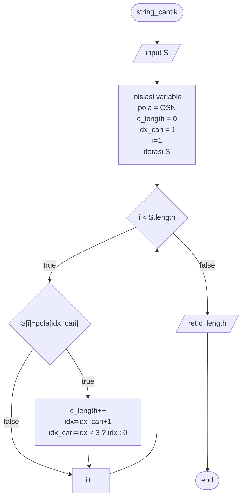
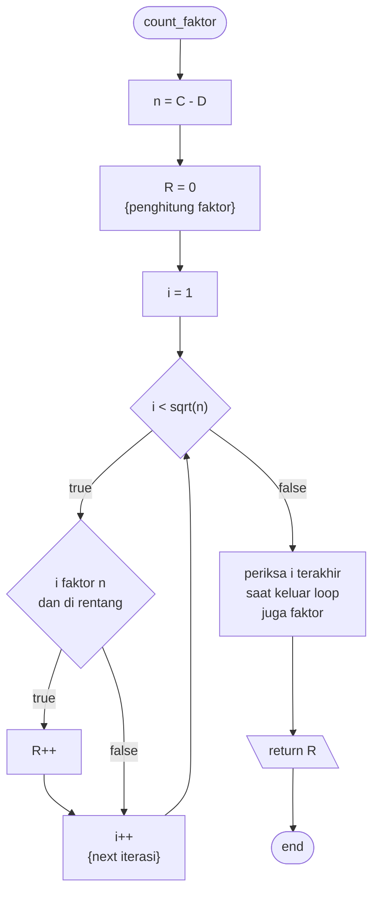

# Solusi OSN-P 2024

Berikut penjelasan algoritma yang digunakan pada solusi pemrograman OSN-P 2024

## Studi Kasus A: String OSN Cantik

Didefenisikan, String Cantik OSN adalah string yang memenuhi syarat

1. Memiliki panjang minimal 3 huruf.
2. Setiap 3 huruf yang berurutan harus terdiri dari tepat 1 huruf ‘O’, 1 huruf ‘S’, dan 1 huruf ‘N’.

Syarat kedua ekuivalen dengan setiap tiga huruf berurutan ketiganya harus huruf berbeda, karna hanya ada 3 pilihan huruf pada 3 tempat dan ketiganya harus ada. Sehingga string cantik OSN hanya ditentukan oleh 2 huruf pertamanya, huruf ketiga dan dst ditentukan oleh huruf pertama dan kedua. Contoh, jika huruf pertama 'O' dan huruf kedua 'N', huruf ketiga harus 'S', huruf keempat harus 'O' karna huruf kedua, ketiga dan keempat harus berbeda.

Jadi, untuk string cantik OSN dengan panjang berapapun adalah salah satu dari 6 pola berikut

1. OSNOSNOSNOS...
2. ONSONSONSON...
3. SONSONSONSO...
4. SNOSNOSNOSN...
5. NOSNOSNOSNO...
6. NSONSONSONS...

Untuk mencari panjang string OSN terpanjang yang bisa dibentuk dari string S sama saja dengan mencari panjang dari keenam pola diatas pada string S dan mengembalikan maksimum dari ketiganya.

---

Untuk mencari panjang pola pertama `OSNOSNOSNOS...` pada string S, dapat dilakukan dengan menelusuri semua huruf dari S dan mencocokkan dengan karakter yang sedang dicari

1. Telusuri atau periksa huruf-huruf dari S secara berurutan mulai dari huruf pertama hingga terakhir.
2. Cocokkan dengan huruf pada pola yang sedang dicari, misalnya pada awalnya untuk pola `OSNOSNOSNOS...`, huruf yang dicari adalah `O`.
3. Jika huruf pada S sama dengan pola dicari, tambahkan panjang pola di S saat ini dan ganti huruf yang dicari dengan huruf berikutnya, jika sebelumnya `O` huruf dicari berikutnya adalah `S`.
4. Lanjutkan penelusuran huruf di String S dan ulangi dari langkah 2 hingga semua huruf di S diperiksa.
5. Lakukan untuk keenam pola yang ada.
6. Hitung maksimum dari panjang keenam pola.
7. Jika panjang maksimum kurang dari 3, maka tidak ada string cantik OSN yang valid.

---

Flowchart untuk menghitung panjang pola `OSN` di string S

Untuk pengecekan bersama semua pola dan maksimum length semua pola diserahkan ke pembaca

## Studi Kasus B: Berbagi Banyak Candil

Diberikan:

- B: banyak bebek maksimal Pak Dengklek
- C: banyak candil yang dibeli
- D: banyak candil yang dimakan Pak Dengklek setelah dibagikan ke para bebek sama rata.
- 1 <= B, C <= 1012
- 0 <= D <= C

Misalkan b : banyak bebek yang dimiliki Pak Dengklek

Dari deskripsi permasalahan yang diberikan jelas bahwa `D = C % b`, dan `b > D`

Dari persamaan `D = C % b` bisa diubah menjadi `0 = (C - D) % b` jadi `b` adalah faktor dari `C - D` yang lebih besar dari `D` dan lebih kecil dari atau sama dengan `B` (banyak bebek maksimal).

Sehingga persoalan mencari banyak kemungkinan banyaknya bebek Pak Dengklek setara dengan mencari banyaknya faktor berbeda dari `C - D` di rentang `(D, B]`.

Perhatikan bahwa jika `i` adalah faktor dari `n`, maka `n/i` juga faktor dari `n`. Jadi alih-alih looping dari `1` hingga `C - D`, hanya perlu loop hingga `i*i > (C - D)`

Banyak faktor `C - D` dapat disimpan di suatu variable dan increment `2` setiap ditemukan faktor dari `C - D` kecuali jika `i * i == (C - D)` hanya increment `1`. Catat juga banyak faktor yang `< D` dan `>= B` untuk dikurangkan dengan banyak faktor dari `C - D` atau hanya increment variable penyimpan faktor `C - D` jika faktor yang ditemukan terletak di rentang `(C, B]`

> [!WARNING]
> Pertimbangkan saat `C - D == 0`

Algoritma diatas divisualisasikan pada diagram dibawah ini

## Studi Kasus C: Tebas Tebang Pohon

Misalkan P(X) = jumlah panjang potongan pohon yang diperoleh Pak Dengklek dengan menebang pada ketinggian X

Perhatikan bahwa P(0), P(1), P(2), dst membentuk barisan terurut menurun. Persoalannya adalah untuk menentukan nilai X terbesar sehingga P(X) >= M.

Karna P(X) terurut, jadi persoalan ini dapat diselesaikan dengan _binary search_ dengan batas pencarian dari 0 hingga ketinggian **pohon tertinggi**.

Implementasi dan flowchart diserahkan ke pembaca

## Studi Kasus D: Kalkulator Pengubah Basis

Misalkan:

- P(Y) menyatakan banyaknya X berbeda, sehingga apabila X diubah ke dalam basis B.
- Y = ...abcdefg; menyatakan digit-digit terakhir yang dikeluarkan kalkulator Pak Dengklek.

Perhatikan bahwa P(Y) = P(...abcdef) + P(...abcde) + P(...abcd) + ... jika g, fg, efg, ... bisa diubah menjadi satu digit pada basis B. Dengan basis rekurens P("") = 1
Misalkan kalkulator mengeluarkan 83472659115 pada pengubahan dengan basis 125, maka

P("83472659115") = P("8347265911") + P("834726591") + P("83472659")

karna 5, 15, dan 115 bisa diubah menjadi satu digit pada basis 125.

> [!TIP]
> Mengubah (_casting_) numeric char satu digit ke integer, gunakan syntax int `n = c -'0';`\
> Contoh: `'9' - '0' == 9`

Persoalan ini membentuk rekursif dan bisa diselesaikan dengan teknik _dynamic programming_ dengan metode _buttom up_ karna besar kemungkinan semua nilai P(Y) pada pemotongan Y diperlukan. Jadi metode _buttom up_ optimal.

> [!WARNING]
> Hati-hati jika disamping digit yang baru disisipkan terdapat digit 0\
> Pada basis 100, P(1034102) = P(103410)\
> 02 tidak bisa diubah jadi satu digit

Implementasi diserahkan ke pembaca

> [!TIP]
> Pengisian tabel DP juga bisa dilakukan dari belakang, dengan basis DP digit terakhir Y\
> P("11583472659") = P("1583472659") + P("583472659") + P("83472659") pada basis 125

## Studi Kasus E: Gosip Gulali

Informasi yang perlu diperhatikan pada permasalahan ini antara lain:

- Ada N bebek, dinomori dari 1 hingga N
- Ada M tingkat kemanisan gulali yang dapat dibeli Pak Dengklek, boleh membeli banyak dengan tingkat kemanisan yang sama
- Tiap bebek memiliki tingkat kemanisan favorit sendiri
- **Ketidakpuasan** bebek adalah selisih tingkat kemanisan favorit bebek dan tingkat kemanisan gulali yang diterima dari Pak Dengklek
- K buah hubungan gosip antar bebek, diterima program dalam pasangan 2 bebek yang bergosip
- Bebek-bebek yang ada di satu kelompok yang sama menerima tingkat kemanisan gulali yang sama
- Tujuan program menghitung **minimum** total ketidakpuasan semua bebek

Dari informasi diatas, diperoleh bahwa:

- Kelompok gosip merupakan graf dengan bebek sebagai vertex, dan edge sebagai penanda 2 bebek bergosip
- Graf yang diberikan dalam _edge_, jadi cocok disimpan dalam struktur _edge list_.
- minimum total ketidakpuasan semua bebek adalah minimum total ketidakpepuasan masing-masing kelompok graf yang terpisah

Dari informasi-informasi yang tersedia, algoritma yang akan digunakan adalah

1. Kelompokkan bebek-bebek yang saling terhubung, harus menerima tingkat kemanisan gulali yang sama
2. Hitung minimum total ketidakpuasan masing-masing kelompok yang terbentuk dengan menentukan gulali yang akan diberikan ke masing-masing kelompok
3. Kembalikan jumlah dari minimum ketidakpuasan semua kelompok

### Mengelompokkan Bebek-Bebek yang Saling Bergosip

Karena graf diberikan dalam struktur _edge list_ dan vertex yang sudah diketahui, metode terbaik yang digunakan adalah dsu (_disjoint set union_) yang disederhanakan karena tidak perlu tahu kedalaman vertex dengan parentnya. Ide dari metode dsu ini adalah pada setiap kelompok dipilih satu vertex untuk menjadi _parent vertex_ dari semua vertex lain, jadi jika v1 dan v2 memiliki parent yang berbeda, v1 dan v2 terletak pada kelompok yang berbeda.

Langkah-langkah yang dilakukan yaitu:

1. Buat array sepanjang vertex yang ada, yang merepresentasikan parent dari tiap vertex, dalam hal ini `int parnet[N]`
2. Pada awalnya parent tiap vertex adalah dirinya sendiri, `parent[i] = i`
3. Untuk setiap edge `v1, v2`
   - Jika parent salah satu vertex dirinya sendiri, gabungkan vertex tersebut ke kelompok vertex lainnya. `parent[v1] == v3` dan `parent[v2] == v2`, ganti `parent[v2] == v3`. Ada kemungkinan `v1 == v3`.
   - Jika parent keduanya bukan dirinya sendiri, kedua vertex di kelompok yang berbeda, gabungkan kedua kelompok. `parent[v1] == v3` dan `parent[v2] == v4`, ganti `parent[v2] = v3` dan semua vertex dengan parent `v4` jadi `v3`
4. Setelah semua edge digabungkan, vertex dengan parent yang sama terletak pada kelompok yang sama
5. Pengelompokan selesai dilakukan

### Minimum Total Ketidakpuasan Kelompok

Jika tingkat kemanisan setiap bebek pada kelompok digambarkan dalam satu dimensi (garis bilangan), total ketidakpuasan kelompok adalah jumlah jarak dari titik tingkat kemanisan yang diberikan ke semua titik tingkat kepuasan bebek di kelompok tersebut.

Mencari gulali yang meminimalkan total ketidakpuasan kelompok dianalogikan dengan:

- Urutkan tingkat kemanisan favorit semua bebek pada kelompok, `[l, l + 1, l + 2, ..., r - 2, r - 1, r]`
- Gambarkan lingkaran-lingkaran yang melalui `(l, r)`, `(l - 1, r - 1)`, `(l - 2, r - 2)` dst
- Gulali yang dipilih adalah gulali tingkat kemanisan yang terletak pada lingkaran paling dalam.

> [!warning]
> Pertimbangkan jika ada sebanyak ganjil bebek pada kelompok dan ada beberapa gulali pada lingkaran terdalam

## Studi Kasus F: Maju Tak Papan

Robot bebek akan terus bergerak ke kanan jika robot bebek berada pada baris terakhir, atau akan terus ke bawah jika robot bebek berada di kolom terakhir.

Perhatikan bahwa, untuk ukuran papan `A*B` dan `B*A` akan memberikan solusi yang sama.

Jika robot terletak di petak selain baris/kolom terakhir, robot selalu memilih petak dengan nilai terbesar. Jadi, robot bebek harus diarahkan ke baris atau kolom terakhir untuk meminimalkan banyak permen yang dimakan.

- Arahkan robot ke baris/kolom terakhir dengan petak terbanyak, lebih banyak permen sedikit yang akan dilalui robot, robot hanya melewati baris/kolom pertama
- Meletakkan permen pada baris/kolom terakhir dengan angka-angka terkecil yang mungkin.
- untuk mencapai petak pertama di baris/kolom terakhir, permen di petak tersebut harus lebih banyak dari permen di petak pilihan lain dari petak menuju baris/kolom terakhir.
- Misalkan M > N, diarahkan ke kolom terakhir.
- Petak pada kolom terakhir akan diisi dengan 1, 2, ..., M-1 permen. diisi dari petak `M*N` hingga `2*N`
- Petak lain yang boleh diisi dengan permen berapapun adalah petak `1*1`, isi dengan M permen.
- Petak `1*2`,`1*3`, dst, `1*N` bisa diisi dengan `M+2`, `M+4`, `M+6`, dst, `M + 2*(N-2)`, dan
- Petak `2*2`,`2*3`, dst, `2*N` bisa diisi dengan `M+1`, `M+3`, `M+5`, dst, `M + 2*(N-2)-1`, sehingga dapat dipastikan robot hanya bergerak di baris 1 dan kolom terakhir.
- Total permen dimakan = `1 + 2 + ... + M + M + 2 + M + 4 + M + 6 + M + 2 * (N - 2)`

Perhitungan dalam bentuk diserahkan ke pembaca

> [!TIP]
> M dan N dapat dipertukarkan untuk memastikan M > N.

# Referensi

Soal dapat diunduh melalui link [soal osp 2024](https://osn.toki.id/data/OSNP2024.pdf)
